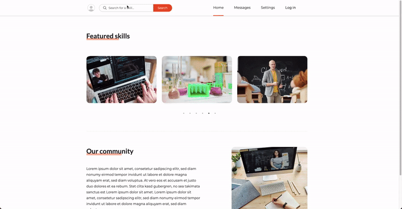
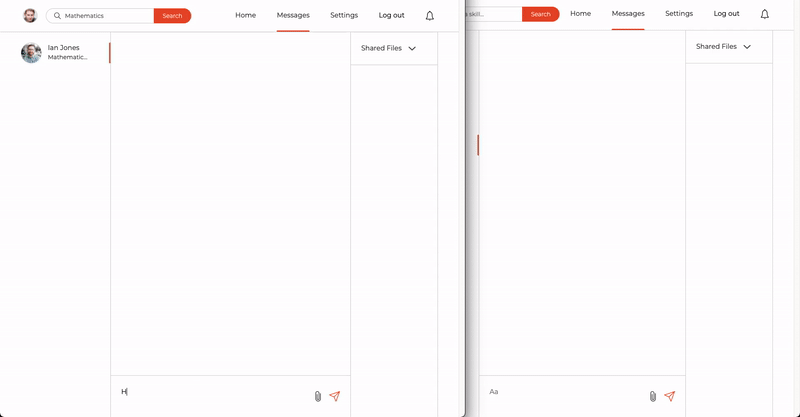
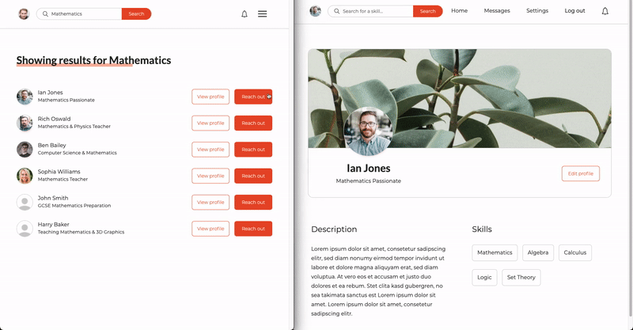
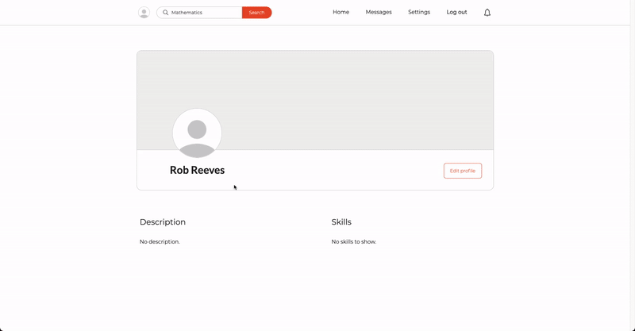

# Skillfinder

## Description

Skillfinder is a social media application designed for students and teachers. It was
created using React, Node/Express and PostgreSQL as a part of the university
coursework. Credits to [George](https://github.com/UP933287) for helping me out
with this project.

Preview (it might take a few seconds before the server wakes up): https://skillfinder.kamilmuzyka.com

### Showcase

|  |
| ------------------------------------------------------------- |

|  |
| ---------------------------------------- |

|  |
| ----------------------------------------------------------- |

|  |
| ----------------------------------------------------- |

### Prerequisites

-   Node.js 16.3.0 ([Download](https://nodejs.org/en/))

-   npm 7.15.1 ([Documentation](https://www.npmjs.com/get-npm))

-   PostgreSQL 13.3 ([Download/Windows](https://www.postgresql.org/download/) | [Download/MacOS](https://postgresapp.com/))

### Installation

1. Run the installation script:

    ```
    npm install
    ```

2. Create a .env file in the project root directory and put the following code
   inside of it:

    ```
    DATABASE_URL=postgres://<DATABASE_USERNAME>:<DATABASE_PASSWORD>@localhost:5432/skillfinder
    JWT_SECRET=<ANY_STRING>
    AWS_BUCKET_NAME=<AWS_S3_BUCKET_NAME>
    AWS_BUCKET_REGION=<AWS_S3_BUCKET_REGION>
    AWS_ACCESS_KEY=<AWS_IAM_USER_ACCESS_KEY>
    AWS_SECRET_KEY=<AWS_IAM_USER_SECRET_KEY>
    ```

    - Replace the <...> fragments with your local settings and the cloud credentials.

    - If you use Postgres for MacOS (Postgres.app), then you can skip setting the password.

    - If you use Postgres for Windows, then the default password should be set to "root".

    - If you named your database different than "skillfinder", change the last bit of the connection URL as well.

3. Run the setup script:

    ```
    npm run setup
    ```

4. Start the application:

    ```
    npm start
    ```

    - You can now access the app at http://localhost:8080.

## Available Scripts

-   Start the development server for the client code:

    ```
    npm run client
    ```

    -   It will start a Browsersync process which should open your browser at http://localhost:3000. This is the development representation of the client code, which will refresh on each client code change.

-   Start the API server:

    ```
    npm run server
    ```

    -   It will start an Express server available at http://localhost:8080.

-   Run both servers:

    ```
    npm run dev
    ```

    -   It will run both the development server for the client code and the API server.

-   Build client code:

    ```
    npm run build
    ```

    -   It will compile the development version of the client code into a production version. The output code will appear at the ./client/build directory. The production version of the application will be served at http://localhost:8080.

-   Create a database for the project and run the initial build:

    ```
    npm run setup
    ```

## Directory Structure

```
    .
    ├── app.js           # Express application
    ├── server.js        # Server instance
    ├── auth             # Auth-related files
    ├── controllers      # Controller functions
    ├── sockets          # WebSocket-related files
    ├── models           # Database models
    ├── data-access      # Data storage files
    ├── routes           # Express subrouters
    ├── constants        # Reusable constants
    ├── utils            # Reusable functions
    ├── client           # UI/Front-end code
    ├── package.json     # Required npm packages
    ├── .env             # Environment variables
    ├── .gitignore       # Files ignored by Git
    ├── .prettierrc      # Prettier configuration
    └── .eslintrc.json   # ESLint configuration
```
